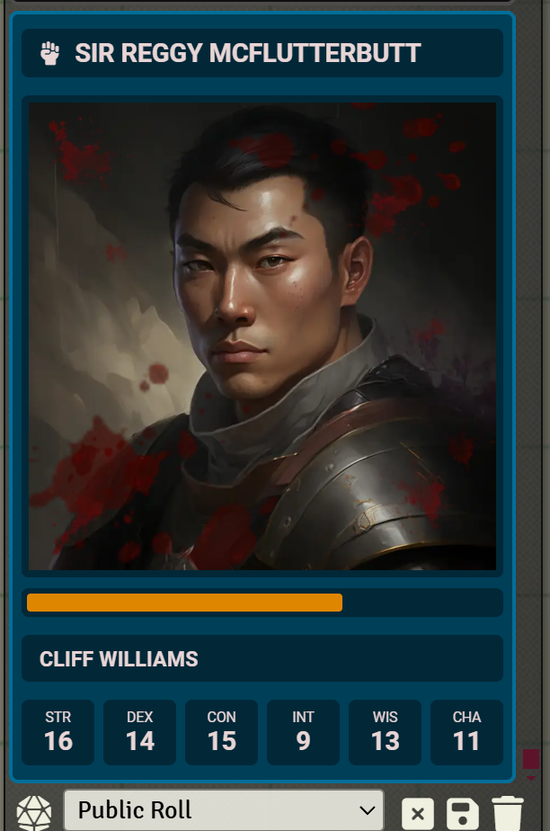
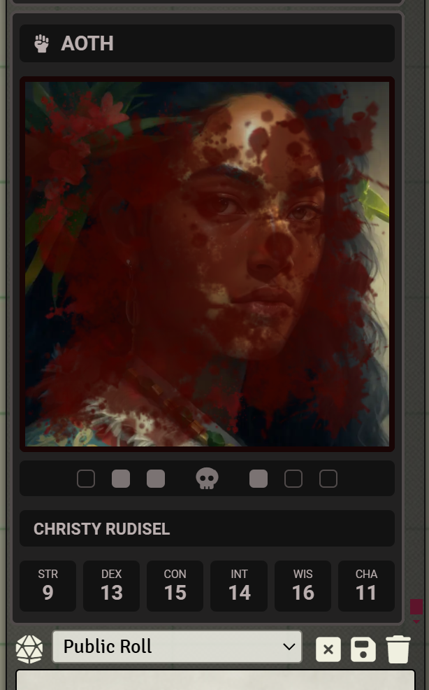
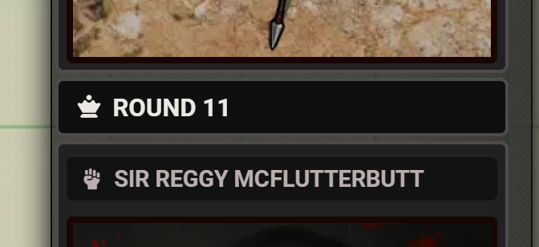
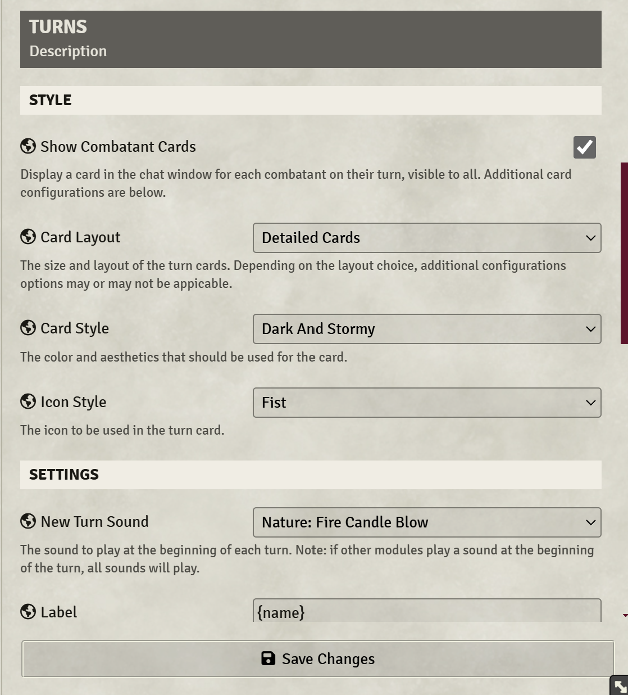
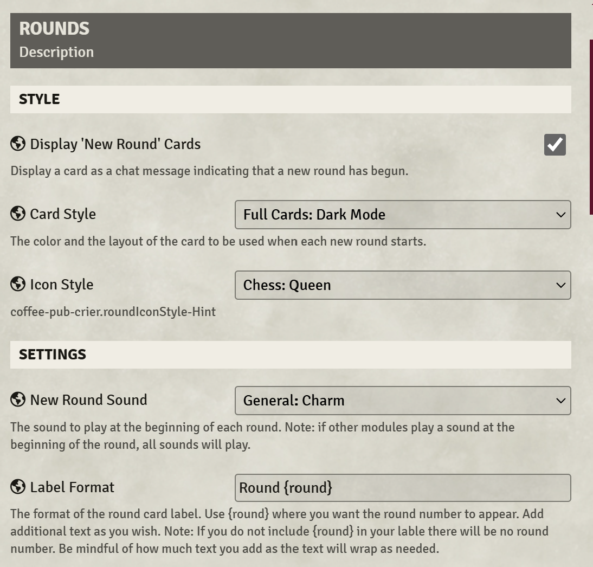

# Coffee Pub Crier

A Foundry VTT module that enhances combat turn announcements and notifications with rich visual and audio features.


> **⚠️ Note:** This module is currently designed for Foundry VTT v12. Foundry VTT v13 compatibility is in development and will be available in a future release.

## Overview

Coffee Pub Crier enhances your Foundry VTT combat experience with rich visual and audio announcements for combat turns, making battles more engaging and easier to follow. **Now fully integrated with Coffee Pub Blacksmith for enhanced customization and shared resources across the Coffee Pub ecosystem.**

## Preview

### Combat Turn Cards


*Combat turn card with blue theme*



*Combat turn card showing death saving throws*

### Round Announcements


*Round transition announcement*

### Module Configuration


*Extensive card customization options*



*Round announcement settings*

## Features

### Combat Turn Announcements
- Custom styled chat messages for character turns
- Configurable character portraits/tokens display
- Optional character stats display including:
  - HP status
  - Ability scores
  - Armor Class
  - Movement speed
  - Death saving throws status
- Three layout options: full, small, or none

### Round Management
- Customizable round announcements
- Configurable sound effects for new rounds
- Visual round transition indicators

### Combat Tracking
- Missed turn detection and GM notifications
- Last combatant action tracking
- Turn order management

### Customization Options
- Configurable card styles for turns and rounds with dynamic theme loading from Blacksmith
- Custom icon selections from comprehensive Font Awesome library
- Toggle visibility of:
  - Player names
  - Ability scores
  - Health status
  - Bloody portraits (damage indicators)
- NPC name obfuscation options
- Customizable sound effects from extensive audio library
- Dynamic background texture options

### Health Status Visualization
- Dynamic health status indicators:
  - Healthy (>75%)
  - Hurt (50-75%)
  - Dying (25-50%)
  - Critical (1-25%)
  - Death Saving/Dead (≤0%)
- Visual death saving throw trackers

### Permission System
- Integrated with Foundry's permission system
- GM-only information handling
- Configurable visibility settings

## Installation

### Method 1: Foundry VTT Interface
1. Inside Foundry's Configuration and Setup screen, go to **Add-on Modules**
2. Click "Install Module"
3. Search for "Coffee Pub Crier"
4. Click 'Install' 

### Method 2: Manifest URL
Use this manifest URL in Foundry's module installer:
```
https://github.com/Drowbe/coffee-pub-crier/releases/latest/download/module.json
```

## Dependencies
- [Coffee Pub Blacksmith](https://github.com/Drowbe/coffee-pub-blacksmith) - **Required** for core functionality and enhanced customization options

## Module Settings

### Round Announcements
- **Round Cycling**: Toggle round announcements on/off
- **Round Card Style**: Choose from multiple styles dynamically loaded from Blacksmith:
  - Full Cards: Dark Mode, Green, Red, Blue Velvet, Brown Earth, and more
  - Simple Cards: Default Foundry
  - Minimal Cards: Plain variants
- **Round Icon**: Customizable icon from comprehensive Font Awesome selection
- **Round Sound**: Choose from extensive sound effect library
- **Round Label**: Customize the round announcement text (default: "Round {round}")

### Turn Announcements
- **Turn Cycling**: Toggle turn announcements on/off
- **Turn Card Layout**: Choose between:
  - Detailed Cards: Full information display
  - Minimal Cards: Simplified view
- **Turn Card Style**: Multiple theme options dynamically loaded from Blacksmith including dark mode and colored variants
- **Turn Icon**: Customizable icon from comprehensive Font Awesome selection
- **Turn Sound**: Choose from extensive sound effect library
- **Turn Label**: Customize the turn announcement text (default: "{name}")

All settings are configurable through the module settings menu in Foundry VTT's configuration panel. **Settings automatically update in real-time when new themes, icons, sounds, and backgrounds are added to the Coffee Pub Blacksmith module.**


## Coffee Pub Ecosystem

This module is part of the larger Coffee Pub ecosystem for Foundry VTT. Other available modules include:

### Coffee Pup Ecosystem

- **[Coffee Pub Blacksmith](https://github.com/Drowbe/coffee-pub-blacksmith)** - Central hub module providing shared utilities, themes, and inter-module communication
- **[Coffee Pub Bibliosoph](https://github.com/Drowbe/coffee-pub-bibliosoph)** - Enhanced library and compendium management
- **[Coffee Pub Monarch](https://github.com/Drowbe/coffee-pub-monarch)** - Advanced campaign and world management tools
- **[Coffee Pub Scribe](https://github.com/Drowbe/coffee-pub-scribe)** - Enhanced journal and documentation features
- **[Coffee Pub Squire](https://github.com/Drowbe/coffee-pub-squire)** - Comprehensive Utility Tray for Character, Party, Juornals, Quests, and Codex

All Coffee Pub modules are designed to work together seamlessly, sharing resources and providing a unified experience.

### Other Modules

- **[Coffee Pub Bubo](https://github.com/Drowbe/coffee-pub-bubo)** - Our first Built-in AI Chatbot.
- **[Coffee Pub Lib](https://github.com/Drowbe/coffee-pub-lib)** -Required for Bubo. For now.


## Support & Community
- Found a bug? Please [open an issue](https://github.com/Drowbe/coffee-pub-crier/issues)
- Have a feature request? [Submit it here](https://github.com/Drowbe/coffee-pub-crier/issues)
- Need help? Contact me on Discord: `drowbe`
- Support Coffee Pub development on [Patreon](https://www.patreon.com/c/CoffeePub)

## Attribution
This module is built for [Foundry Virtual Tabletop](https://foundryvtt.com/).

## License
This module is licensed under the [MIT License](./LICENSE).

## Credits
Created by drowbe

