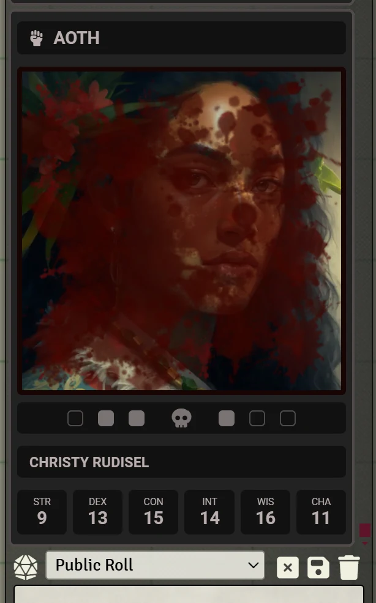
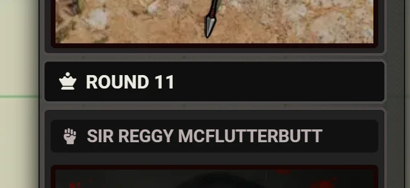

# Coffee Pub Crier

Crier narrates your combats. It posts a card to chat when a fight starts, at the top of every round,
as each combatant's turn comes up, and when the fight ends -- so nobody has to ask whose turn it is.





## What it does

- Announces combat start, each round, each turn, and combat end as chat cards.
- Puts the combatant's portrait or token art on the turn card, splattered with blood as they take damage.
- Carries health, ability scores, status and conditions, and this turn's penalties on the card, each
  shown to an audience you choose -- nobody, players, monsters, or everyone.
- Lets whoever owns a downed character roll their death saving throw from the card, and keeps the
  pips current for everyone watching.
- Holds every card until initiative has settled, so no card ever names the wrong combatant.
- Whispers a reminder to the GM when somebody looks to have missed a turn.
- Hides monster names from players, on the rule you pick.
- Takes its themes, icons and sounds from Coffee Pub Blacksmith, so cards match the rest of the suite.

## Requirements

- **Foundry VTT v13.** Verified against v13; v14 is declared as the maximum.
- **The D&D 5e system.** Health, ability scores, conditions and death saves are read from dnd5e.
- **[Coffee Pub Blacksmith](https://github.com/Drowbe/coffee-pub-blacksmith), enabled.** Required.
  Crier's card themes, icons and sounds all come from it, and Crier does not run without it.

## Install

In Foundry's **Add-on Modules** screen, choose **Install Module** and paste this manifest URL:

```
https://github.com/Drowbe/coffee-pub-crier/releases/latest/download/module.json
```

## Where to read more

The [wiki](https://github.com/Drowbe/coffee-pub-crier/wiki) carries the documentation:

- **[Getting started](https://github.com/Drowbe/coffee-pub-crier/wiki/userguide-getting-started)** --
  what appears once the module is on, who sees what, and the settings worth changing first.
- **[Architecture](https://github.com/Drowbe/coffee-pub-crier/wiki/architecture-crier)** -- for
  anyone working on Crier itself.
- **[Known issues](https://github.com/Drowbe/coffee-pub-crier/wiki/known-issues)** -- what is broken
  right now.

## The Coffee Pub suite

Crier is one of a family of modules that share Blacksmith as a hub.

- **[Blacksmith](https://github.com/Drowbe/coffee-pub-blacksmith)** -- Quality of life, gameplay frameworks, automation, and aesthetic improvements. Required by the rest of the suite.
- **[Artificer](https://github.com/Drowbe/coffee-pub-artificer)** -- A crafting, recipe, and blueprint system.
- **[Bibliosoph](https://github.com/Drowbe/coffee-pub-bibliosoph)** -- In-game player messaging with journal-backed conversations, plus authored injuries, quick encounter building, inspiration, and critical hit announcements.
- **[Cartographer](https://github.com/Drowbe/coffee-pub-cartographer)** -- Party strategic planning and sketching.
- **[Curator](https://github.com/Drowbe/coffee-pub-curator)** -- Image management: token replacement, portrait replacement, and tile and map image placement.
- **[Herald](https://github.com/Drowbe/coffee-pub-herald)** -- Streaming and broadcast view, with a designated cameraman user for a clean, UI-free view that follows tokens.
- **[Librarian](https://github.com/Drowbe/coffee-pub-librarian)** -- A codex of people, places, factions and artifacts, and the quests that run through them.
- **[Merchant](https://github.com/Drowbe/coffee-pub-merchant)** -- Shops and merchants: mark an actor as a merchant and let players browse and acquire from their stock.
- **[Minstrel](https://github.com/Drowbe/coffee-pub-minstrel)** -- A music, environment, and one-shot manager.
- **[Monarch](https://github.com/Drowbe/coffee-pub-monarch)** -- Save and load sets of enabled modules.
- **[Regent](https://github.com/Drowbe/coffee-pub-regent)** -- Optional AI tools: lookup, character, assistant, encounter and narrative worksheets.
- **[Scribe](https://github.com/Drowbe/coffee-pub-scribe)** -- Enhanced journal and chat card formatting for sharing snippets of narrative.
- **[Squire](https://github.com/Drowbe/coffee-pub-squire)** -- A customizable character tray for abilities, items, spells and conditions, with party tools.
- **[Vault](https://github.com/Drowbe/coffee-pub-vault)** -- Optional assets for the Coffee Pub suite.

<!-- global:ai-assistance -->
## AI Assistance and the Illusion of Good Code

I started writing Foundry modules for use at my own table back in 2020. There were already a ton of amazing modules out there, but they either didn't quite do what I wanted or didn't deliver the kind of user experience I was looking for.

I've been a design leader for more than 20 years, but I spent the first half of my career as a developer, so building my own modules seemed like a fun way to kill some time. I'm a pretty good designer. I'm a decent developer. But, over time, my hand-written code and hacks got a little messy (and memory-leaky, and a little buggy. Feels good to say it out loud.).

Today, the Coffee Pub suite of modules is developed with AI assistance, primarily Claude and Cursor, for documentation, refactoring, debugging, and other development work. Every change is reviewed and committed by me, and nothing reaches a release that I haven't crawled and run at my own table. I can't seem to give up my IDE. The UX design, architecture, and ideas still come from my own fever dreams and chronic lack of sleep.

Testing and verifying a change means running it in Foundry so I can watch the console, break things, fix them, and hone the experience. The repositories carry a set of tools for testing the things that are difficult to catch through review and manual testing alone. They help ensure styles don't conflict, shared coding and documentation standards stay consistent, and the suite of modules continues to work well as a system without silently breaking.

Those checks are there because AI-assisted development can move very quickly, and without oversight, engagement, and planning, it can also go confidently off the rails and deliver the illusion of good code. The AI helps me build faster. It doesn't decide what gets built, its architecture, or how it should work. You can blame this human for that.

If the idea of AI-assisted development keeps you up at night or just isn't your jam, no worries at all. I get it. You do you.
<!-- /global:ai-assistance -->

## Support

- Found a bug, or want a feature? [Open an issue](https://github.com/Drowbe/coffee-pub-crier/issues).
- Need help? Contact me on Discord: `drowbe`
- Support Coffee Pub development on [Patreon](https://www.patreon.com/c/CoffeePub).

## Licence and credits

Built for [Foundry Virtual Tabletop](https://foundryvtt.com/) by drowbe, and licensed under the
[MIT License](./LICENSE).
