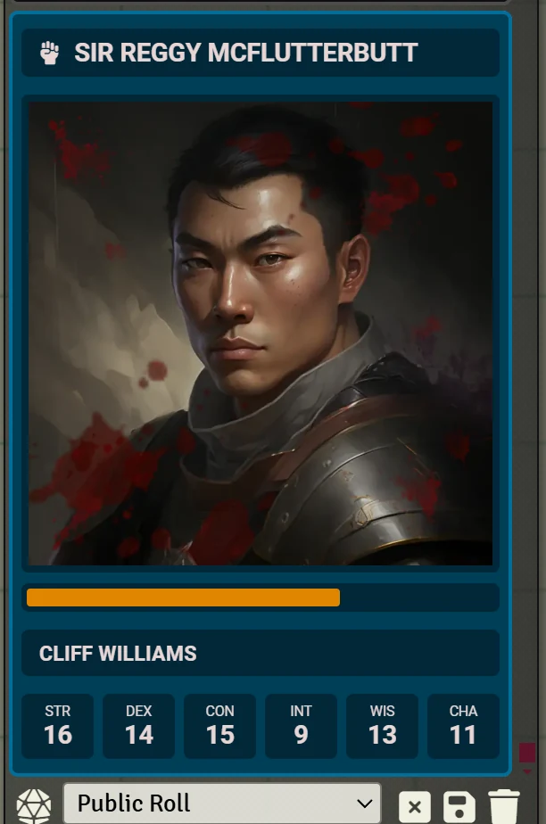

# Coffee Pub Crier

**Audience:** everyone -- players, GMs, and contributors.

Crier narrates combat in chat. It posts a card when a fight begins, when each round turns over, when
each combatant's turn comes up, and when the fight ends, and it can carry the combatant's health,
ability scores, conditions and death saves on the turn card. Crier requires
[Coffee Pub Blacksmith](https://github.com/Drowbe/coffee-pub-blacksmith), which supplies the card
themes, icons and sounds it draws on.

This page routes. Each section points at the document that answers the question rather than
answering it here.

## Using Crier at the table

Start with [getting started](userguides/userguide-getting-started.md): what appears the moment the
module is enabled, who sees what, and the handful of settings worth changing first.

## Working on Crier itself

[The architecture document](architecture/architecture-crier.md) covers how Crier decides what to
announce and when -- the hold-and-release rules that keep a card from posting before initiative has
settled, how a card is composed from Blacksmith parts, and which behaviour is resolved per reader
rather than baked into the posted card.

## Known issues

Defects that are real and unfixed are in [known issues](known-issues.md).
