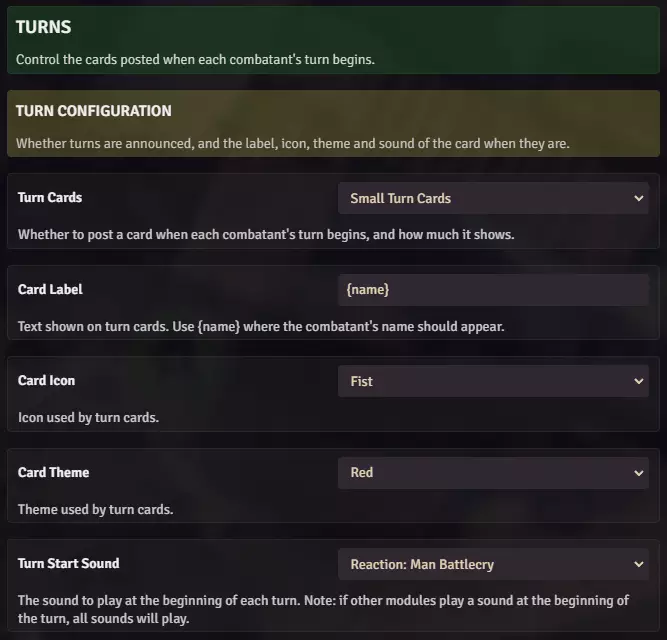

# Card Themes, Icons and Wording

**Audience:** the GM setting up a world.

How to change what Crier's cards look like and what they say. Each kind of card -- combat, round,
turn -- has its own icon, theme and label, so they can be told apart at a glance in a busy chat log.

## Set a theme

**Card Theme** picks the card's colour. Each section has its own: one for the combat cards, one for
round cards, one for turn cards.

Giving the three different themes is what makes a scrolled-back chat log readable -- a red combat
card, a green round card and a neutral turn card separate at a glance without anybody reading them.

## Set an icon

**Card Icon** picks the small mark in the card's header, from the same three sections. Combat start
and combat end share one icon; rounds and turns have their own.

## Change the wording

Each card's label is plain text you type, and two of them take a placeholder:

- **Start Label** and **End Label** -- the combat cards. Plain text.
- **Round Label** -- defaults to `Round {round}`. `{round}` becomes the round number.
- **Card Label**, under **Turn Configuration** -- defaults to `{name}`. `{name}` becomes the
  combatant's name.

Remove a placeholder and that value simply does not appear; keep it where you want the value to fall.
A long label wraps, so keep them short.

## Where the lists come from

The theme and icon lists are Blacksmith's, not Crier's. When Blacksmith adds a theme or an icon it
shows up in these dropdowns on its own, and the cards match the rest of the Coffee Pub suite by
default.
