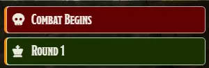

# Getting Started with Crier

**Audience:** GMs and players using Crier at the table.

The first five minutes: what Crier needs installed, what it puts in chat once it is enabled, and why
the first cards of a fight wait. The settings themselves are in
[the settings guide](userguide-settings.md).

## What you need installed

Crier requires **Coffee Pub Blacksmith**, and will not work without it. Blacksmith supplies the card
themes, icons and sounds that Crier's settings choose from, so install and enable it first.

Crier is built for the D&D 5e system; health, ability scores, conditions and death saves all come
from it.

## What changes the moment you enable it

Nothing changes outside of combat. Start a fight and Crier posts cards to chat as it runs:

- A card when combat begins, and another when it ends.
- A card at the top of each round, reading **Round 1**, **Round 2**, and so on.
- A card for each combatant as their turn comes up, carrying their portrait and their health,
  ability scores, conditions and death saves.

Everyone at the table sees these cards. Only one card is posted per event, by the GM, and everyone
reads the same one.

Out of the box, health, ability scores and turn penalties appear on cards for player characters
only, and conditions appear on everyone's. All of that is adjustable -- see
[the settings guide](userguide-settings.md).

## Why the first cards wait for initiative

Crier posts nothing -- not the round card, not the first turn card -- until combat has started and
every combatant has rolled initiative. This is deliberate: a card announced before the order settles
names whoever happened to be first at that instant, and the tracker then re-sorts underneath it.

So on a table that rolls initiative one combatant at a time, expect chat to stay quiet through the
rolling and then catch up the moment the last initiative lands. The same applies to a combatant
added mid-fight: cards pause until that combatant has rolled.

If cards never arrive on a fight where everyone has rolled, that is a defect rather than this rule --
see [known issues](../known-issues.md).

## Turn a whole kind of card off

If you want less in chat, this is the fastest change to make. Open **Configure Settings**, then
**Module Settings**, and find Crier. Each section opens with one control saying whether that card is
posted at all:

- **Combat Cards** -- *Do Not Announce Combat*, *Announce Start Only*, *Announce End Only*, or
  *Announce Start and End*.
- **Round Cards** -- *Do Not Announce Rounds* or *Announce Rounds*.
- **Turn Cards** -- *Do Not Announce Turns*, *Large Turn Cards*, or *Small Turn Cards*.

The sounds are the other common first change. Each kind of card has its own sound dropdown with a
*None* option, and the turn sound is the one that fires most often.

## Where to go next

- [Settings](userguide-settings.md) -- every control, by its on-screen name.
- [For players](userguide-player.md) -- what you see on a card, and rolling a death save from it.
- [For GMs](userguide-gm.md) -- deciding who sees what, hiding monster names, and missed-turn
  reminders.
