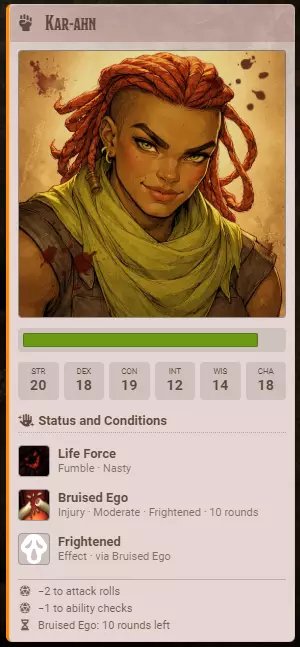
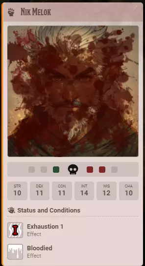

# Crier for Players

**Audience:** players at the table.

What Crier puts in front of you during a fight, and the one thing on it you can click.

## What you see

When combat starts, cards appear in chat: one for the start of the fight, one at the top of each
round, and one for each combatant as their turn comes up. Everyone sees the same cards -- they are
posted once, by the GM, not built separately for each of you.

Your own card is a summary of where you stand as your turn begins: your health, your ability scores,
anything currently affecting you, and what those effects cost you on this turn -- the modifier you
are about to roll with, and how long until it lifts.

## What you may not see

Your GM chooses what each card carries, and can choose differently for characters and for monsters.
A common setup shows health and ability scores for player characters but not for monsters, so you
will see your own party's hit points and not the enemy's.

Some monsters' names may read as `???`. That is deliberate -- your GM has hidden them until you learn
what you are fighting. The GM sees the real name.

## Roll a death save from your card

If your character drops to zero hit points, their turn card shows death save pips in place of the
health bar: your successes and failures so far.

Click the card to roll your death save. The roll goes to chat like any other, and the pips update on
everyone's screen. This step is described from how Crier is built rather than from someone having
walked it at a table, so if it does not behave this way, that is worth reporting.

**Only the character's owner can roll it.** If it is not your character, you will see the pips and
the button will not respond -- that is correct behaviour, not a broken card.

## Why nothing appears while you are rolling initiative

Crier holds every card until everyone has rolled. Chat stays quiet through the rolling and then
catches up once the last initiative is in, so no card ever names the wrong person. If someone joins
the fight late, the same pause happens again until they have rolled.
