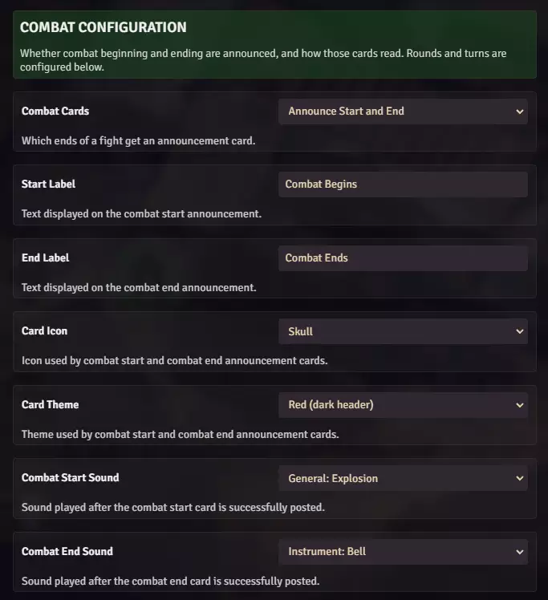
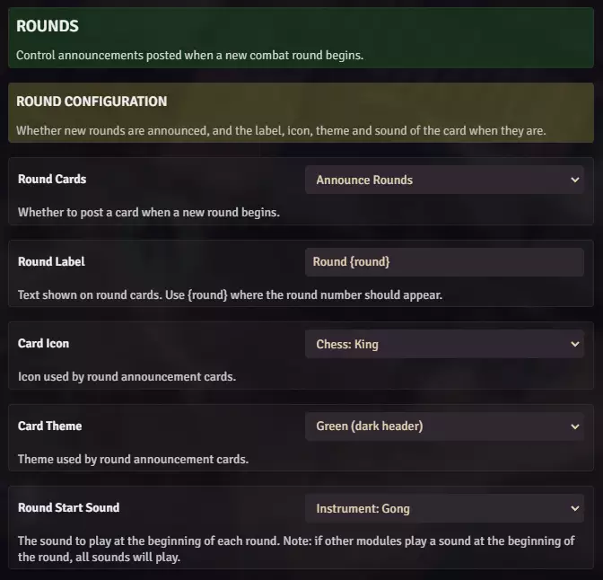
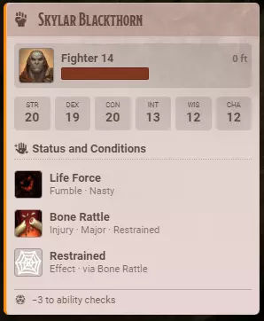
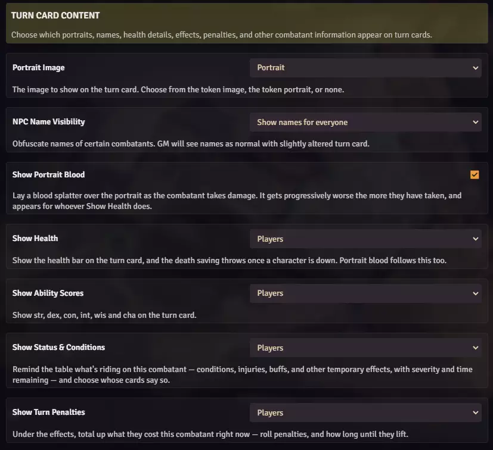
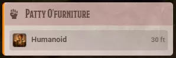

# Crier Settings

**Audience:** the GM configuring Crier for a world.

Every Crier control, by the name it carries on screen, in the order the settings window shows them.
All of these are world settings: one GM sets them and they apply to the whole table.

Open **Configure Settings**, then **Module Settings**, and find Crier.

## Combat Configuration

Whether the beginning and end of a fight are announced, and how those cards read.

- **Combat Cards** -- *Do Not Announce Combat*, *Announce Start Only*, *Announce End Only*, or
  *Announce Start and End*. Which ends of a fight get a card.
- **Start Label** and **End Label** -- the text on each card. Plain text; type what you want it to
  say.
- **Card Icon** and **Card Theme** -- the icon and colour, shared by both combat cards. The lists
  come from Blacksmith, so they grow when Blacksmith adds to them.
- **Combat Start Sound** and **Combat End Sound** -- played after the card posts. Set either to
  *None* for silence.

## Round Configuration

Announcements posted when a new round begins.

- **Round Cards** -- *Do Not Announce Rounds* or *Announce Rounds*.
- **Round Label** -- the text on the card, defaulting to `Round {round}`. `{round}` is replaced with
  the round number; remove it and no number appears.
- **Card Icon** and **Card Theme** -- the round card's icon and colour.
- **Round Start Sound** -- played at the top of each round. If another module also plays a sound
  then, both play.

## Turn Configuration

Whether each combatant's turn is announced, and how that card reads.

- **Turn Cards** -- *Do Not Announce Turns*, *Large Turn Cards*, or *Small Turn Cards*.
- **Card Label** -- the text on the card, defaulting to `{name}`, which is replaced with the
  combatant's name.
- **Card Icon** and **Card Theme** -- the turn card's icon and colour.
- **Turn Start Sound** -- played at the start of each turn. This is the sound that fires most often,
  so it is usually the first one a table turns off.

**The two layouts are two shapes, not two levels of detail.** Everything under **Turn Card Content**
applies to both. *Large Turn Cards* stacks the portrait, health bar and ability scores; *Small Turn
Cards* folds the portrait, class, speed and health bar into one compact row.

## Turn Card Content

What each turn card carries, and whose cards carry it.

- **Portrait Image** -- *None*, *Token*, or *Portrait*. Which picture sits on the card, if any.
- **NPC Name Visibility** -- whether a monster's real name reaches players. Covered in
  [the GM guide](userguide-gm.md).
- **Show Portrait Blood** -- on or off. Lays a blood splatter over the portrait as the combatant
  takes damage, getting worse the more they have taken.
- **Show Health** -- the health bar, and the death save pips once a character is down.
- **Show Ability Scores** -- str, dex, con, int, wis and cha.
- **Show Status & Conditions** -- conditions, injuries, buffs and other temporary effects, with
  severity and time remaining.
- **Show Turn Penalties** -- what those effects cost the combatant right now: roll penalties, and how
  long until they lift.

**The last four are audiences, not switches.** Each offers *Do Not Show*, *Players*, *NPCs and
Monsters*, or *Players, NPCs, and Monsters* -- see [the GM guide](userguide-gm.md) for how to choose.
**Show Portrait Blood** has no audience of its own; it follows **Show Health**.

With all four set to *Do Not Show*, a turn card is just the combatant's name and identity line:

## Missed Turns

- **Missed Turn Reminders** -- *Do Not Remind*, *Chat Card Only*, or *Chat Card and Notification*.
  The reminder is whispered to the GMs alone; see [the GM guide](userguide-gm.md).

## A note on the theme, icon and sound lists

Those three lists are Blacksmith's, not Crier's. When Blacksmith adds a theme, icon or sound, it
appears in these dropdowns without Crier changing.
