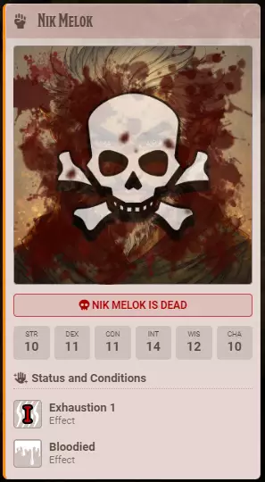
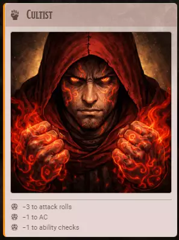

# Turn Cards

**Audience:** GMs and players at the table.

The card Crier posts when a combatant's turn comes up: what is on it, how it changes as the fight
goes badly, and the two shapes it comes in. The controls behind all of this are listed in
[the settings guide](userguide-settings.md).

## What is on a card

A full turn card can carry, from the top: the combatant's name, their portrait or token art, a
health bar, their six ability scores, their current conditions, and what those conditions cost them
this turn.

None of it is fixed. Each block is switched on for an audience -- players, monsters, both, or nobody
-- so a card shows what you chose to share about that kind of combatant. With every block off, a card
is just a name and an identity line:

## Read the health bar

The bar tracks the combatant's hit points and changes colour as they fall. If **Show Portrait Blood**
is on, the portrait picks up a blood splatter at the same time, getting heavier the more damage they
have taken.

Health has three readings, and the card swaps between them rather than stacking them:

- **A bar**, while they are standing.
- **Pips**, once they are at zero and rolling death saves.
- **A band**, once they are dead.

## When a character goes down

At zero hit points the health bar is replaced by death save pips -- successes and failures, filled in
as they are rolled.

The pips are live. Whoever owns that character can roll the save from the card itself; see
[the player guide](userguide-player.md). A posted card stays current as hit points and death saves
change, so the bar, the pips and the blood all move on every client without anyone reposting.

If they die, the pips give way to a band naming them:

## Read the conditions and penalties

**Status and Conditions** lists what is currently on the combatant -- conditions, injuries, buffs and
other temporary effects. Each row gives the effect's name, its type and severity, and how long is
left on it. Hovering an effect's icon shows its rules text.

Underneath, the penalties block totals what those effects cost the combatant *right now*: the
modifier they are about to roll with, any bleed they will take, and how long until it lifts. It is a
readout only -- Crier applies nothing and rolls nothing on its own.

A monster's card can carry the penalties without carrying its health, which is a common way to keep a
fight readable without giving the party a hit point count:

## Choose a shape

**Turn Cards** offers *Large Turn Cards* and *Small Turn Cards*. They are two shapes of the same
card, not two levels of detail -- every content setting applies to both.

The small layout folds the portrait, class, walking speed and health bar into a single row. Pick it
when the table wants the information without the height.
